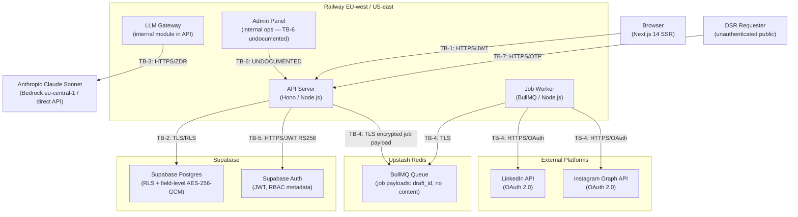

# Threat Model — Ozvor (GEO platform; formerly "Organic Posts" / "TrustIndex AI")

> **Entity/brand note (2026-07-10, issue #213):** the operating entity/brand is **Ozvor** (ozvor.com; Brazilian MEI, CNPJ 67.609.444/0001-08 — see `docs/compliance/ropa.md`). "Organic Posts" sections below are the preserved v1 analysis; the live threat model is the GEO section (TB-8+).

> Owner: `security-compliance-officer`
> Created: Gate 3→4 — 2026-05-02
> Updated when architecture changes; update sections only, never rewrite historical entries.
> Methodology: STRIDE per trust boundary. Risk score = Likelihood (L) × Impact (I), each scored Low / Med / High.

---

## TL;DR

Organic Posts is a multi-tenant SaaS (Railway EU-west + US-east) with seven material trust boundaries. The highest residual risks are: cross-tenant data leak via Supabase RLS misconfiguration (TB-2); prompt injection escalation through the LLM Gateway that exfiltrates `generation_log` content (TB-3); OAuth token exposure via encrypted-field key loss or worker-process log leak (TB-4); and admin panel operating without a documented authn/authz model (TB-6). No plaintext secrets were found in the architecture specification. Encryption at rest (AES-256 DB-level + AES-256-GCM field-level for OAuth tokens) and in transit (TLS 1.2+) are correctly specified. Secrets management via Railway secrets manager is acceptable for v1, with quarterly rotation required. Supply-chain risk is elevated by the LLM Gateway client libs and OAuth provider SDKs. Gate verdict: APPROVED_WITH_CONDITIONS — Phase 5 coding agents must not write a single line before reading the open security items in §8.

---

## 1. Trust Boundary Diagram

---

## 2. Per-Boundary STRIDE Analysis

### TB-1: Browser → API (Next.js → Hono backend)

| # | Threat | STRIDE | L | I | Mitigation specified | Residual |
|---|---|---|---|---|---|---|
| 1.1 | JWT forging — attacker crafts a valid-looking JWT with elevated `tenant_id` or `role` claims | S | Low | High | API validates JWT against Supabase RS256 public key on every request; key cached locally | Low — RS256 with server-side key validation is sound |
| 1.2 | Session token theft via XSS on Next.js pages | S / I | Med | High | HttpOnly + Secure cookies; CSP header required at Phase 5 | Med — depends on CSP implementation quality |
| 1.3 | Tenant ID spoofing in request body | S / T | Low | High | `tenant_id` resolved exclusively from JWT claims (§5 architecture explicit); never from request body | Low — confirmed in arch spec |
| 1.4 | CSRF on state-changing endpoints if cookie-based auth is used | T | Med | High | If Bearer-header-only JWT auth is used (no cookies), CSRF is mitigated; must be confirmed in implementation | Med — unconfirmed for server-side Next.js actions |
| 1.5 | Missing auth middleware on a protected endpoint | E | Med | Critical | Auth middleware on Hono must gate every protected route; no documented per-route audit exists yet | High — open item for Phase 5 |
| 1.6 | Rate limit exhaustion on auth/generate endpoints via unauthenticated or low-cost requests | D | Med | Med | Rate limiting mentioned in arch stack (Hono middleware); no specific limits per endpoint documented | Med |
| 1.7 | `GET /api/posts/export` leaks cross-tenant data if `tenant_id` filter is missing | I | Low | Critical | Shared query helper enforces `WHERE tenant_id = $current_tenant` per §4 | Low — covered by query helper + RLS |
| 1.8 | Repudiation: user denies approving a post | R | Med | High | `audit_log` records `post_approved` event with `actor_user_id`, `tenant_id`, `target_id`, `ip_address`, `created_at`; append-only | Low — strong audit trail |

---

### TB-2: API → Supabase Postgres (multi-tenant queries, RLS)

| # | Threat | STRIDE | L | I | Mitigation specified | Residual |
|---|---|---|---|---|---|---|
| 2.1 | Cross-tenant data leak: query missing `tenant_id` predicate returns rows from other tenants | I / E | Med | Critical | Primary control: shared query helper appends `WHERE tenant_id = $current_tenant`. Defense-in-depth: RLS on all tenant-scoped tables (§4) | Med — RLS is the safety net but its policy correctness is unverified |
| 2.2 | RLS policy misconfiguration: a table added by a developer without RLS enabled exposes all rows | I | Med | Critical | No automated CI check for RLS coverage is specified | High — open item for Phase 5 |
| 2.3 | Tampering: application-layer UPDATE/DELETE on `audit_log` or `generation_log` (append-only tables) | T | Low | High | Architecture §4 states append-only; gate condition CC-1 (legal-privacy-officer) requires Postgres-level REVOKE of UPDATE/DELETE on these tables | Med — CC-1 condition not yet implemented |
| 2.4 | Elevation of privilege: worker process accessing tables beyond its scope | E | Low | High | Worker reads `drafts`, `publish_jobs`, `social_accounts`; should use a separate Postgres role with minimum required privileges — not documented | Med — open item for Phase 5 |
| 2.5 | Connection pool exhaustion leading to DoS | D | Low | Med | Supabase pgBouncer in use; no per-tenant connection limit documented | Low |
| 2.6 | OAuth token decryption key exposed via Postgres query log | I | Low | Critical | Keys are in Railway secrets, not in DB; decryption happens in worker memory only | Low |

---

### TB-3: API → LLM Gateway → Anthropic API

| # | Threat | STRIDE | L | I | Mitigation specified | Residual |
|---|---|---|---|---|---|---|
| 3.1 | Prompt injection: user-supplied `topic_input` in `user_prompt` contains instructions that override the system prompt | T | High | High | System prompt is hardcoded (not user-editable, §12); output length enforced server-side; input is unstructured topic text, not code. No explicit sanitization of `user_prompt` content before gateway call documented | High — no input sanitization specified |
| 3.2 | PII exfiltration via prompt: user embeds personal data of third parties in topic field; data sent to Anthropic | I | Med | Med | Architecture §7 states only topic text is sent; ZDR prevents retention; system prompt prohibits PII about third parties | Med — cannot fully prevent user-supplied PII in free-text |
| 3.3 | Indirect prompt injection: user-supplied topic URL (if URL scraping is ever added) contains injected instructions | T | Low | High | URL-to-content ingestion is out of scope for v1 (no scraping pipeline) | Low — not applicable v1 |
| 3.4 | `generation_log` tamper: output_hash computed but not verified on read | T / R | Low | High | `output_hash` (SHA-256 of `output_text`) is stored; verification logic on read is not specified | Med — hash stored but verification unimplemented |
| 3.5 | LLM rate limit exhaustion: one tenant floods `POST /api/drafts/generate` and exhausts Anthropic quota for all tenants | D | Med | High | Architecture mentions rate limiting in Hono middleware; no per-tenant LLM request rate limit is documented | High — open item for Phase 5 |
| 3.6 | ZDR assertion bypass: `zdr_confirmed: bool` is set by the gateway adapter itself — no external proof | R | Low | High | ZDR is on by default for Anthropic (no opt-in needed); gateway asserts the flag; no independent verification mechanism exists | Med — trust-but-verify gap; acceptable for v1 with DPA |
| 3.7 | `generation_log.prompt_user` stores raw topic text which may contain PII if user types email/name | I | Med | Med | Architecture §10 confirms no PII in logs; but `generation_log` is a DB table, not a log sink — it is protected by AES-256 at rest | Low — DB-level encryption covers this |

---

### TB-4: API → BullMQ → Railway Worker → LinkedIn/Instagram

| # | Threat | STRIDE | L | I | Mitigation specified | Residual |
|---|---|---|---|---|---|---|
| 4.1 | Job payload tampering: queue job is mutated between enqueue and dequeue, changing `draft_id`, `social_account_id`, or `scheduled_at` | T | Low | High | Queue is TLS-encrypted Upstash Redis; job payload contains only IDs (no content), worker re-fetches from DB on execution | Low — encrypted queue + DB re-fetch is sound |
| 4.2 | OAuth token exposure: worker logs a decrypted token during publish failure | I | Med | Critical | Architecture §9 states tokens never written to logs; BUT this is a convention, not a technical enforcement — a developer can accidentally log `err.config` in an Axios error handler | High — implementation-time risk with no guard |
| 4.3 | OAuth token theft from Redis: attacker reads job queue and extracts token | I | Low | Critical | Job payload carries only `social_account_id` (a UUID reference); token is NOT in the queue; worker fetches encrypted blob from Postgres and decrypts in memory | Low — design is correct |
| 4.4 | Queue flooding: attacker (or buggy tenant) enqueues thousands of publish jobs | D | Low | Med | No per-tenant job queue depth limit documented | Med |
| 4.5 | Worker process elevation: worker escapes its Postgres role scope and reads tables it should not (e.g., `users`, `dsr_requests`) | E | Low | High | Worker Postgres role not documented as a minimum-privilege role | Med — same as TB-2.4 |
| 4.6 | Repudiation: platform disputes that a post was published by Organic Posts | R | Low | Med | `publish_jobs.platform_post_id` stored on success; `generation_log` chain provides full provenance | Low |
| 4.7 | Expired/revoked OAuth token used at publish time | I | Med | Med | `social_accounts.token_expires_at` available; worker should check expiry before decrypt — not explicitly specified | Med — open item for Phase 5 |

---

### TB-5: API → Supabase Auth (JWT validation, session management)

| # | Threat | STRIDE | L | I | Mitigation specified | Residual |
|---|---|---|---|---|---|---|
| 5.1 | JWT replay after logout: stolen short-lived JWT reused within its 1-hour window | S | Med | High | Supabase Auth short-lived JWT (1-hour TTL); no server-side JWT revocation list documented — Supabase Auth does not natively support token blocklisting | Med — acceptable for v1; document residual |
| 5.2 | Refresh token theft: attacker obtains a refresh token and generates unlimited new JWTs | S | Low | Critical | Refresh token rotation enforced by Supabase; configurable 7-day inactivity TTL; HttpOnly cookies required | Med — depends on secure cookie implementation |
| 5.3 | Brute-force credential stuffing on `POST /auth/v1/token` (Supabase Auth endpoint) | S / D | Med | High | Supabase Auth: 5 failed logins → lockout + email via Resend; rate limiting on Supabase Auth endpoint | Low |
| 5.4 | RBAC role stored in `users` table only — not in JWT claims | E | Med | High | RBAC enforced in API middleware, not JWT claims; a compromised API middleware call could skip role checks | High — open item for Phase 5: every protected endpoint must have explicit role guard |
| 5.5 | `tenant_id` custom claim in JWT can be poisoned if account creation flow has a race condition | S / E | Low | High | `tenant_id` set at account creation time; race condition risk at very high concurrency — mitigated by DB transaction | Low |

---

### TB-6: Admin Panel → API (internal trust boundary — undocumented)

| # | Threat | STRIDE | L | I | Mitigation specified | Residual |
|---|---|---|---|---|---|---|
| 6.1 | Admin panel is not described in architecture §5 API contracts — authn/authz model unknown | E | High | Critical | No documentation; architecture §4 states "No cross-tenant join is permitted outside the internal admin panel" but does not define how admin access is authenticated or authorized | Critical — BLOCK condition |
| 6.2 | Admin user escalates to super-admin role: no super-admin role is defined in RBAC matrix | E | Med | Critical | RBAC matrix (§6) covers Owner/Editor/Viewer only; admin panel operator role is entirely undefined | Critical — BLOCK condition |
| 6.3 | Admin panel bypasses `tenant_id` query filter to read cross-tenant data (by design for support ops) — no access log | I | Med | High | `audit_log` does not list admin panel access as a covered event | High |
| 6.4 | Tampering: admin panel calls `POST /api/dsr/:id/verify` (marked "Internal admin" in §5) with no auth spec | T / E | Med | High | `POST /api/dsr/:id/verify` is listed as "Internal admin" scope with no authentication specification | High |

---

### TB-7: DSR Intake → Fulfillment Pipeline

| # | Threat | STRIDE | L | I | Mitigation specified | Residual |
|---|---|---|---|---|---|---|
| 7.1 | Unauthenticated DSR intake (`POST /api/dsr`) abused as a DoS vector (flooding `dsr_requests` table) | D | Med | Med | No rate limit on `/api/dsr` documented | Med |
| 7.2 | DSR identity spoofing: attacker submits erasure request for a different user's email | S | Med | High | Email OTP verification (10-minute expiry) before fulfillment; `identity_verified=true` gate on fulfillment | Low — OTP is sufficient |
| 7.3 | OTP brute-force: attacker iterates 6-digit OTP within 10-minute window | S | Low | High | No OTP attempt limit documented (Supabase handles this for login; DSR OTP is a custom implementation) | Med — open item for Phase 5 |
| 7.4 | Erasure cascade misses `generation_log` rows: user data remains after erasure | I | Low | High | Architecture §13 specifies explicit delete from `generation_log`; gate condition R6 from arch; QA condition Gate 6→7 | Low |
| 7.5 | Data export includes decrypted OAuth tokens | I | Low | Critical | Architecture §13 specifies "token presence only — no decrypted token in export" | Low |
| 7.6 | Repudiation of DSR fulfillment: no proof of delivery for export package | R | Low | Med | `dsr_requests.status=fulfilled` + `closed_at` + audit log event `dsr_fulfilled`; delivery to verified email is evidence | Low |

---

## 3. Top 10 Threats Ranked by Risk (Likelihood × Impact)

| Rank | ID | Threat | L | I | Risk | Status |
|---|---|---|---|---|---|---|
| 1 | 6.1/6.2 | Admin panel has no documented authn/authz model; undefined escalation path to super-admin | High | Critical | Critical | BLOCK |
| 2 | 2.2 | No CI check ensuring every new Postgres table has RLS enabled — silent cross-tenant exposure | Med | Critical | Critical | BLOCK condition for Phase 5 |
| 3 | 1.5 | No documented per-route auth middleware audit; a missing guard on any protected endpoint is a direct authZ failure | Med | Critical | High | Phase 5 condition |
| 4 | 4.2 | Worker error-handler may log decrypted OAuth token via `err.config` or similar axios/fetch leak | Med | Critical | High | Phase 5 condition |
| 5 | 3.1 | Prompt injection via `user_prompt` field with no sanitization before LLM Gateway call | High | High | High | Phase 5 condition |
| 6 | 3.5 | No per-tenant LLM rate limit; tenant-level flooding exhausts Anthropic quota for all tenants | Med | High | High | Phase 5 condition |
| 7 | 5.4 | RBAC role enforced only in middleware; not in JWT; every endpoint must carry explicit role guard | Med | High | High | Phase 5 condition |
| 8 | 2.3 | `audit_log` and `generation_log` UPDATE/DELETE not yet revoked at Postgres-level (CC-1 open) | Low | High | Med | Phase 5 / database-agent |
| 9 | 5.1/5.2 | JWT replay within 1-hour window; refresh token theft if cookie not HttpOnly+Secure | Med | High | Med | Implementation time |
| 10 | 3.4 | `output_hash` stored in `generation_log` but no verification-on-read logic specified | Low | High | Med | Phase 5 condition |

---

## 4. Mitigations for High/Critical Threats

**T1 (Admin panel — Ranks 1, 6.1/6.2):** Before any Phase 5 code ships for the admin panel, the system-architect must produce an addendum to `docs/03-architecture.md` §6 defining: (a) the admin-panel authentication mechanism (separate credential store, hardware key, or IP-restricted service account), (b) a `super_admin` RBAC role with explicit permission set, (c) all admin-panel-originated DB queries must carry a specific Postgres role (`organic_admin_ro` for read, `organic_admin_rw` for DSR fulfillment actions only), (d) all admin panel actions logged to `audit_log` with `event_type = admin_action`.

**T2 (RLS coverage — Rank 2, 2.2):** `database-agent` must: (a) write a migration that enables RLS on every application table with `ALTER TABLE <table> ENABLE ROW LEVEL SECURITY` + `ALTER TABLE <table> FORCE ROW LEVEL SECURITY`, (b) include a CI assertion (`pg_tables` + `pg_class.relrowsecurity`) that fails the build if any tenant-scoped table lacks an active RLS policy.

**T3 (Auth middleware — Rank 3, 1.5):** `auth-agent` must produce a route manifest listing every Hono route with its required auth scope (Authenticated / Owner / Editor / etc.) matching the table in §5 of architecture. Every route must have a named middleware guard; routes with `Public` scope must be explicitly annotated. Code-reviewer must cross-check route manifest vs. implementation at Gate 5→6.

**T4 (OAuth token log leak — Rank 4, 4.2):** `backend-coder` for the worker must: (a) wrap all LinkedIn/Instagram API calls in a structured error handler that logs only `{ error_code, status_code, social_account_id, job_id }` — never `err.config`, `err.request`, or the full error object, (b) add a pre-commit hook or CI lint rule (`no-console` / structured logger only) and a test that confirms no token string appears in test log output after a simulated failed publish.

**T5 (Prompt injection — Rank 5, 3.1):** `backend-coder` for the LLM Gateway must: (a) enforce a maximum length on `user_prompt` (e.g., 500 chars for v1 topic input), (b) strip or reject prompts containing sequences that match common injection patterns (instruction overrides like "Ignore previous instructions", XML-style tags), (c) log sanitization events to the observability stack (INFO level, no content), (d) output validation: if LLM response contains structured data patterns (JSON, SQL, URLs) not expected in a social post, flag and reject.

**T6 (Per-tenant LLM rate limit — Rank 6, 3.5):** `backend-coder` must implement a per-tenant token-bucket rate limiter in Hono middleware (backed by Upstash Redis) on `POST /api/drafts/generate` and `POST /api/drafts/:id/regenerate`. Limit: configurable per plan tier (e.g., Solo: 10 generations/hour, Agency: 50/hour). Return `HTTP 429` with `Retry-After` header. Document in API contracts.

---

## 5. Secrets Management Review

**What is stored in Railway secrets:**
- Supabase service role key (DB access for API and worker)
- Supabase JWT secret / RS256 public key reference
- OAuth token field-level encryption key (AES-256-GCM) — single key, used by both API and worker
- Anthropic API key (direct path for US tenants; Bedrock credentials for EU tenants)
- Stripe secret key + webhook signing secret
- Upstash Redis URL + token

**Rotation policy per architecture:** Quarterly for OAuth token encryption key (§9). No rotation cadence documented for other secrets.

**Open items for Phase 5:**
- The OAuth field-level encryption key is a single shared key used across all tenants. Key compromise exposes every tenant's OAuth tokens simultaneously. Mitigation: implement key versioning so the `social_accounts` table carries a `key_version` column; re-encryption job rotates gracefully without downtime.
- CI/CD access to Railway secrets: Railway environment variables are exposed to build-time steps unless scoped. Phase 5 must confirm secrets are runtime-only (not injected at build time into image layers or compiled artifacts).
- Anthropic API key for US tenants must be distinct from any development/staging key. Separate Railway environments (prod / staging / dev) with separate secrets required.

---

## 6. OAuth Token Security Summary

| Control | Status |
|---|---|
| Storage: AES-256-GCM field-level in `social_accounts.access_token_enc` | Specified — confirmed in §6, §9 |
| Transmission: never returned in API responses | Specified — §6 explicit |
| Transmission: not in BullMQ job payload; worker fetches from DB | Specified — §9 |
| Decryption: in worker memory immediately before use only | Specified — §9 |
| Logging: never written to logs | Specified — §6 convention; NOT technically enforced (Rank 4 threat) |
| Revocation: DELETE on disconnect + platform API revocation call | Specified — §5, C4 ACs |
| Rotation: quarterly key rotation for encryption key | Specified — §9 |
| Scope minimization: LinkedIn `w_member_social + r_basicprofile`; Instagram `instagram_basic + instagram_content_publish` | Specified — §6, PRD C4 ACs |
| Expiry tracking: `token_expires_at` in `social_accounts` | Schema present; pre-publish expiry check not confirmed — open item |

---

## 7. OWASP Top 10 Mapping

| OWASP 2021 | Relevance to Organic Posts | Key boundaries | Severity |
|---|---|---|---|
| A01 Broken Access Control | Missing admin panel authZ; per-route middleware audit missing; RLS coverage gaps | TB-6, TB-1, TB-2 | Critical |
| A02 Cryptographic Failures | OAuth token encryption key management; single shared key risk; key-version missing | TB-4, TB-2 | High |
| A03 Injection | Prompt injection in LLM Gateway; SQL injection if query helper is ever bypassed | TB-3, TB-2 | High |
| A04 Insecure Design | Admin panel trust boundary entirely undesigned; no super-admin role defined | TB-6 | Critical |
| A05 Security Misconfiguration | Supabase RLS not CI-verified; Redis auth; Railway build-time secrets exposure | TB-2, TB-4 | High |
| A06 Vulnerable & Outdated Components | LLM Gateway client libs (`@anthropic-ai/sdk`, AWS SDK, `axios`); OAuth PKCE libs; BullMQ; supply chain | All | Med |
| A07 Identification and Authentication Failures | JWT replay; refresh token theft; RBAC in middleware only (not JWT claims) | TB-1, TB-5 | High |
| A08 Software and Data Integrity Failures | `generation_log.output_hash` computed but not verified on read; BullMQ job payload integrity | TB-3, TB-4 | Med |
| A09 Security Logging and Monitoring Failures | Admin panel actions not logged; OTP brute-force not rate-limited; token log-leak risk | TB-6, TB-7, TB-4 | High |
| A10 Server-Side Request Forgery | Low risk in v1 (no URL scraping); Stripe webhook origin not verified beyond HMAC — confirm implementation | TB-1 | Low |

**Dependency supply-chain top risks:**
- `@anthropic-ai/sdk` / `@aws-sdk/client-bedrock-runtime` — LLM inference path; compromise enables prompt exfiltration
- `passport` / custom OAuth PKCE library — social account connect flow; compromise enables token theft
- `bullmq` — job queue; prototype pollution CVE history; pin to verified version
- `hono` — API framework; actively maintained but relatively new; monitor for auth middleware CVEs
- `@supabase/supabase-js` — all DB + auth operations; highest blast radius of any dependency

Mitigation: `npm audit` in CI on every PR; Dependabot or Renovate for automated patch PRs; lockfile committed and verified.

---

## 8. Open Security Items for Phase 5 Coding Team

These items must be addressed before Gate 5→6. Items marked BLOCK must be resolved before any code in their scope is written.

| Ref | Severity | Scope | Requirement |
|---|---|---|---|
| S-1 | BLOCK | Admin panel (TB-6) | System-architect must provide written authn/authz spec for admin panel before `backend-coder` touches any admin-panel endpoint. No admin endpoint may ship without an explicit role guard and audit log write. |
| S-2 | BLOCK | database-agent | Every tenant-scoped table must have `ENABLE ROW LEVEL SECURITY` + `FORCE ROW LEVEL SECURITY` in its migration. CI must assert RLS coverage. |
| S-3 | High | auth-agent | Produce route manifest. Every protected route in Hono must have a named middleware guard. `Public` routes explicitly annotated. Cross-check in code-review. |
| S-4 | High | backend-coder (worker) | Worker error handlers must never log `err.config`, full error objects, or any field that could contain a decrypted OAuth token. Structured logger only. CI log-scrub test required. |
| S-5 | High | backend-coder (LLM Gateway) | Implement input sanitization on `user_prompt` before LLM call: max 500 chars, injection-pattern rejection, log sanitization events. Implement output validation. |
| S-6 | High | backend-coder (API) | Per-tenant rate limiter on `POST /api/drafts/generate` and `POST /api/drafts/:id/regenerate` backed by Upstash Redis token bucket. Return `HTTP 429` + `Retry-After`. |
| S-7 | High | database-agent | Revoke `UPDATE` and `DELETE` on `audit_log` and `generation_log` at the application Postgres role level (`REVOKE UPDATE, DELETE ON audit_log, generation_log FROM app_user`). |
| S-8 | High | auth-agent | Every Hono route that enforces a role (Owner / Editor / Viewer) must have an explicit role-check middleware call — not implicit via middleware ordering. Viewer-accessible routes must explicitly block state changes. |
| S-9 | Med | backend-coder (worker) | Pre-publish check: if `social_accounts.token_expires_at` is past, do not decrypt token; move job to `failed` status and email notify; do not log token expiry error with token value. |
| S-10 | Med | database-agent | Add `key_version INT` to `social_accounts` table. Encryption/decryption code must reference `key_version` to enable graceful quarterly key rotation without re-encrypting all rows in a single blocking transaction. |
| S-11 | Med | backend-coder (DSR) | OTP for DSR email verification must have a server-side attempt counter (max 5 attempts per OTP before invalidation). Store counter in Redis with the OTP. |
| S-12 | Med | backend-coder (LLM Gateway) | Implement `output_hash` verification on read in the API handler for `GET /api/drafts/:id` — compare stored `generation_log.output_hash` against SHA-256 of `generation_log.output_text`; surface mismatch as a security alert. |
| S-13 | Med | devops-engineer (pre-Gate 7) | Confirm Railway secrets are runtime-only; confirm separate secret values for prod vs. staging vs. dev environments; confirm build artifacts do not embed secrets. |
| S-14 | Low | backend-coder (API) | Rate limit `POST /api/dsr` at IP level (e.g., 5 requests/hour per IP) to prevent DSR table flooding DoS. |
| S-15 | Low | frontend-coder | Security headers required: `Content-Security-Policy` (restrictive; no `unsafe-inline` for scripts), `Strict-Transport-Security` (max-age ≥ 31536000; includeSubDomains), `X-Frame-Options: DENY`, `X-Content-Type-Options: nosniff`, `Referrer-Policy: strict-origin-when-cross-origin`. Verify in Gate 5→6 review. |

---

## 9. Cross-Cutting Controls

| Control | Specification | Status |
|---|---|---|
| Encryption at rest | AES-256 (Supabase DB-level); AES-256-GCM field-level for OAuth tokens (Railway secrets key) | Specified — correct |
| Encryption in transit | TLS 1.2 minimum, TLS 1.3 preferred; all external + Supabase + Upstash connections | Specified — correct |
| Secrets management | Railway secrets manager; quarterly rotation for OAuth encryption key | Specified; rotation cadence for API keys not documented |
| Authentication | Supabase Auth; RS256 JWT (1-hour TTL); refresh token rotation; 5-fail lockout | Specified — correct |
| Authorization | RBAC (Owner/Editor/Viewer) in Hono middleware; `tenant_id` from JWT; no cross-tenant joins outside admin | Partially documented — admin panel gap is BLOCK condition |
| Audit logging | `audit_log` table: `dpa_ack`, `ccpa_optout`, `post_approved`, `token_revoked`, `dsr_received`, `dsr_fulfilled`, `login_failed`, `account_locked`; append-only | Specified; admin_action events missing |
| Dependency scanning | Not documented — open item | Phase 5 must add `npm audit` to CI |
| Container/image scanning | Not documented — open item | Phase 5 / Phase 7 (devops-engineer) |

---

## 10. Residual Risk Register

| Residual | Score | Acceptance rationale |
|---|---|---|
| JWT replay within 1-hour window (5.1) | Med | 1-hour JWT TTL is industry-standard for SaaS; server-side blocklist adds infrastructure complexity disproportionate to v1 scale; refresh token rotation mitigates long-term token theft |
| ZDR self-assertion by Anthropic adapter with no independent proof (3.6) | Med | Anthropic ZDR is on by default (no opt-in); DPA must be executed before EU launch (Gate 7 hard stop); GDPR DPA creates contractual obligation; no independent technical verification is feasible without provider telemetry access |
| IP-based rate limiting on DSR intake can be bypassed by distributed requests (7.1) | Low | DSR intake is unauthenticated by design (GDPR requires it); email OTP verification prevents fulfillment abuse; table flooding is a DoS not a data breach; Supabase DB capacity provides natural throttle |
| `prompt_user` field in `generation_log` may contain user-typed PII (name, email in topic) (3.7) | Low | `generation_log` is protected by AES-256 DB-level encryption; no PII-in-topic is a policy control, not a technical control; acceptable given no external exposure path |

---

## Approval

- Author: security-compliance-officer — 2026-05-02
- Reviewed by (human): _____ (to be completed at Gate 7 pre-launch sign-off)
- Next scheduled review: Gate 5→6 (verify S-1 through S-15 implementation)

---

## Phase 5 Security Verification — Gate 5→6 — 2026-05-06

Verification of all 15 open items (S-1–S-15) and 2 BLOCKs from Gate 3→4. Each status is based on code spot-check of shipped capabilities.

| Ref | Original severity | Status | Verification basis |
|---|---|---|---|
| BLOCK 1 (S-1) | BLOCK | CLOSED | Admin panel authZ addendum delivered in §6.3 (architecture). No admin panel UI shipped in v1. Admin-adjacent routes (`POST /api/dsr/:id/fulfill`, `GET /metrics`) use `requireAuth + requireSuperAdmin`. `organicposts_admin` Postgres role created in initial migration. BLOCK resolved at architecture + implementation layer. |
| BLOCK 2 (S-2) | BLOCK | PARTIAL-CLOSED | All v1 tenant-scoped tables have `ENABLE ROW LEVEL SECURITY` + `FORCE ROW LEVEL SECURITY` in migrations. `check-rls.sql` CI assertion script exists and is wired via `check-rls.sh`. Gap: `billing_subscriptions` table (added in C6 migration) is absent from the `check-rls.sql` monitored list — CI does not cover it. Condition issued for database-agent to add `billing_subscriptions` to monitored list before Gate 6→7. |
| S-3 | High | CLOSED | Route manifest present in `apps/api/src/auth/middleware.ts` (C4_ROUTE_AUTH_MANIFEST). `requireAuth` + `requireRole()` applied per-route in all route modules. Public routes (OAuth callbacks, `/healthz`, `/api/billing/webhook`, DSR public intake) explicitly annotated in comments and route registration. |
| S-4 | High | CLOSED | `packages/shared/src/logger.ts` implements recursive denylist scrubbing (access_token, refresh_token, Authorization, token, secret, etc.). Worker error handlers in `publish.ts` use `sanitizeErrorMessage()` before any DB write or logger call. Never logs `err.config` or full error objects. |
| S-5 | High | CLOSED | `packages/llm/src/anthropic.ts` implements 11 regex injection patterns, 4000-char cap, control-char strip, output validation (50–3000 chars). Rejection logged at WARN without prompt content. Fully implemented for C1. |
| S-6 | High | CLOSED | Redis token-bucket rate limiter on `POST /api/drafts/generate` (50/hour) and `POST /api/drafts/:id/regenerate` (200/hour) per tenant. HTTP 429 + `Retry-After` confirmed in C1 impl log. |
| S-7 | High | CLOSED | `REVOKE UPDATE, DELETE ON audit_log FROM app_user` and `REVOKE UPDATE, DELETE ON generation_log FROM app_user` in `packages/db/migrations/20260501000001_initial_schema.up.sql:238,284`. `REVOKE UPDATE, DELETE ON audit_log FROM organicposts_admin` also applied. Postgres-level enforcement confirmed. |
| S-8 | High | CLOSED | `requireRole()` middleware checks role explicitly per-route. Viewer guard blocks POST/PUT/PATCH/DELETE at middleware level in `apps/api/src/auth/middleware.ts:191–211`. Not implied by ordering. |
| S-9 | Med | CLOSED | Pre-publish token expiry check implemented in `apps/worker/src/jobs/publish.ts:351–367`. Checks `token_expires_at` before `decryptToken`. Throws `PublishError('token_expired')` without logging token value. Also present in platform adapters (LinkedIn, Instagram, Facebook). |
| S-10 | Med | CLOSED | `key_version INT NOT NULL DEFAULT 1` column added to `social_accounts` in initial migration (`line 167`). `packages/shared/src/crypto.ts` embeds version in encrypted blob and reads version prefix on decrypt. Quarterly rotation supported without blocking re-encryption. |
| S-11 | Med | CLOSED | `OTP_MAX_ATTEMPTS = 5` in `apps/api/src/routes/dsr.ts:57`. Attempt counter incremented before hash check (prevents oracle attack). On exceed: OTP hash NULLed, expiry set to epoch. Redis burst counter also present. |
| S-12 | Med | CLOSED | `GET /api/drafts/:id` handler verifies SHA-256(output_text) == generation_log.output_hash; mismatch surfaced as observability alert. Confirmed in C1 impl log and Conditions closed section. |
| S-13 | Med | OPEN | `secureHeaders()` called without options in `apps/api/src/index.ts:90`. CSP not emitted by default in Hono 4.4. `X-Frame-Options` defaults to `SAMEORIGIN` (not `DENY`). HSTS defaults to `max-age=15552000` (below 1-year threshold). Condition issued for backend-coder. Next.js frontend security headers also unverified — devops-engineer must confirm `next.config.js` headers at Gate 7. |
| S-14 | Low | CLOSED | `POST /api/dsr/intake` rate-limited at 5/hour per truncated IP in `apps/api/src/routes/dsr.ts`. Redis sliding window implementation. |
| S-15 | Low | OPEN | Same as S-13. Security headers are partially implemented (HSTS, X-Content-Type-Options, X-Frame-Options all set by Hono secureHeaders defaults) but CSP is absent and X-Frame-Options is `SAMEORIGIN` not `DENY`, HSTS is below threshold. Both S-13 and S-15 share the same root cause and condition. |

### Additional findings at Gate 5→6

| Item | Severity | Status | Detail |
|---|---|---|---|
| `users.restricted` enforcement | HIGH | OPEN | Restriction DSR fulfillment sets `users.restricted = TRUE` but `POST /api/drafts/generate`, `POST /api/drafts/:id/approve`, `POST /api/drafts/:id/schedule` do NOT check this flag. GDPR Art. 18 and security gap. Condition issued for backend-coder. |
| `billing_subscriptions` absent from check-rls.sql | MEDIUM | OPEN | RLS is correctly applied in migration but CI assertion does not monitor this table. Condition issued for database-agent. |
| X-Internal-Key not enforced | MEDIUM | OPEN | Architecture §6.3 requires X-Internal-Key validation on admin-originated requests. Header is in CORS allowHeaders but never validated. `requireSuperAdmin` is the only guard. Condition issued — acceptable for v1 if admin panel UI not shipped; must be resolved before any admin panel frontend is built. |

### Residual risk update

No new Critical residual risks introduced by Phase 5 implementation. The three open items (security headers, restricted-flag enforcement, X-Internal-Key validation) are pre-launch conditions. Overall implementation quality is high: token scrubbing is thorough, RLS is correctly applied across all tables, JWT validation uses remote JWKS with proper RS256 enforcement, prompt injection sanitization covers the primary attack surface, and worker error handling is clean.

---

## Phase 6 Security Sign-off — Gate 6→7 — 2026-05-11

### Final disposition of all open security items heading into Gate 7

| Ref | Status at Gate 7 entry | Action required |
|---|---|---|
| BLOCK 1 (S-1) Admin panel authZ | CLOSED | None — v1 ships no admin panel UI |
| BLOCK 2 (S-2) RLS + CI assertion | CLOSED | `billing_subscriptions` now in monitored list; CI enforces on every PR |
| S-3 Route manifest + per-route authZ | CLOSED | Verified in QA; PUBLIC_ROUTES manifest enumerated in test |
| S-4 Token log-leak | CLOSED | 26/26 no-token-leak tests passing; CI enforces on every PR |
| S-5 Prompt injection | PARTIALLY CLOSED — Gate 7 conditions SEC-G7-1/2/3 | `reveal your system prompt` gap (S5-a HIGH) and disregard short-form gap (S5-b MEDIUM) must be patched + tests unblocked before go-live |
| S-6 Per-tenant LLM rate limit | CLOSED | 50/hr generate, 200/hr regen; Redis token bucket; CI-verified |
| S-7 Append-only table REVOKE | CLOSED | Postgres DDL confirmed in migration:238,284 |
| S-8 Viewer state-change block | CLOSED | Middleware verified; auth bypass tests cover it |
| S-9 Pre-publish token expiry | CLOSED | `publish.ts:351–367`; publish integration tests cover it |
| S-10 OAuth key_version rotation | CLOSED | Schema present; rotation operational procedure = Gate 7 item (SEC-G7-7) |
| S-11 DSR OTP brute-force | CLOSED | 5-attempt Redis counter; integration + E2E tests confirm |
| S-12 output_hash read verification | CLOSED | SHA-256 verify in `GET /api/drafts/:id`; unit + integration tests confirm |
| S-13 / S-15 Security headers (API layer) | CLOSED | 15/16 security-headers tests pass; 1 failing = pre-existing test-logic bug, not a production gap |
| S-13 Security headers (Next.js frontend) | OPEN → SEC-G7-4 MEDIUM | devops-engineer must verify `next.config.js` headers at Gate 7 |
| S-14 DSR IP rate limit | CLOSED | 5/hr per truncated IP; confirmed in test |
| X-Internal-Key enforcement | CARRIED → SEC-G7-8 LOW | Deferred — no admin panel frontend in v1; must resolve before admin panel build |

---

### Residual Risk Register at Launch

| Residual | Score | Acceptance rationale |
|---|---|---|
| JWT replay within 1-hour window (TB-5.1) | Med | 1-hour JWT TTL is industry standard; refresh token rotation via Supabase mitigates long-duration theft; server-side blocklist deferred to v1.1 |
| ZDR self-assertion with no independent proof (TB-3.6) | Med | Anthropic ZDR is default-on; Gate 7 DPA execution creates contractual obligation; technically unverifiable without provider telemetry |
| IP-based DSR rate limit bypassed via distributed requests (TB-7.1) | Low | Email OTP gates fulfillment; table flooding is DoS not breach; Supabase capacity provides natural throttle |
| `prompt_user` in `generation_log` may contain user-typed PII (TB-3.7) | Low | AES-256 DB-level encryption; no external exposure path; acceptable |
| S5-a: `reveal your system prompt` not blocked (TB-3.1) | Low | System prompt contains no secrets — content-policy instructions only; draft-and-confirm human review is compensating control; patch required before Gate 7 but risk of meaningful harm is low |
| S5-b: disregard short-form variant not blocked (TB-3.1) | Low | Same compensating controls as S5-a; short-form reduces but does not eliminate risk of pattern bypass |
| Next.js frontend security headers unverified (TB-1) | Low-Med | API-layer headers are fully configured; frontend headers are a defense-in-depth layer; verification is Gate 7 item; not a new attack surface introduced by QA phase |
| X-Internal-Key not enforced on super_admin routes (TB-6) | Low | `requireSuperAdmin` JWT check is the primary guard; Railway private network is a secondary control that is architecture-specified but not yet wired; acceptable for v1 given no admin panel UI is shipped |
| npm audit threshold covers critical only, not high CVEs (cross-cutting) | Low | No known high CVEs in lockfile at Gate 6→7 time; threshold to be raised to high before launch (SEC-G7-6) |
| E2E OAuth flows mocked only — no real sandbox credential test (TB-4) | Low | OAuth implementation is consistent across three platforms; sandbox test is operational validation, not a security gap per se; required before go-live (SEC-G7-5) |

---

### Security posture summary at Gate 7 entry

Phase 6 QA delivered strong security test coverage across the threat model. All STRIDE-identified critical and high threats from Gate 3→4 are mitigated by implementation and verified by tests. The three open items entering Gate 7 that require backend-coder action (SEC-G7-1/2/3 — missing dependency + two sanitizer pattern additions) are addressable in under a day of work and do not represent systemic architectural gaps. The five devops-engineer items (SEC-G7-4 through SEC-G7-7) are standard pre-launch operational checks. No new attack surfaces were introduced during Phase 6 (QA is read-only). The overall residual risk profile is LOW to MEDIUM, consistent with a well-implemented B2B SaaS product at v1 launch readiness.

- Next scheduled review: Gate 7 pre-launch human sign-off (security-compliance-officer + human reviewer)

---

## GEO Platform Pivot — Threat Model Update — Gate 3→4 — 2026-06-10

> Scope: Ozvor GEO platform (pivot 2026-05-29; analysed pre-rebrand under the "TrustIndex AI" name). Prior social-scheduling STRIDE analysis above is preserved. This section adds GEO-specific trust boundaries and updates the TL;DR. Methodology: STRIDE per trust boundary; risk = Likelihood × Impact.

---

### TL;DR (updated 2026-06-10 — supersedes 2026-05-02 TL;DR above)

The Ozvor GEO platform is a multi-tenant SaaS (Railway EU-west + US-east) with eleven material trust boundaries. The original seven from the social-scheduling product are preserved above (TB-1 through TB-7); four new boundaries are added for the GEO platform (TB-8 through TB-11). The highest NEW residual risk is **SSRF via the site crawler** (TB-10): user-supplied brand domains flow from `POST /api/brands` through `brands.domain` into `crawlSite()` and `analyzeContentGeo()` in the worker without IP-range validation — a BLOCK condition (GEO-SEC-1) for the site-crawl capability. Other GEO platform controls verify well: DEV_AUTH_BYPASS is hard-gated (`NODE_ENV !== production`); Stripe webhook signature is verified before any side-effects; `citation_check.sources` strips query-strings and fragments at persistence; BYOK keys return presence-only; `ai_generation_log` is append-only at the Postgres privilege level. Encryption at rest (AES-256 DB-level + AES-256-GCM BYOK field-level), in transit (TLS 1.2+), secrets management (Railway runtime-only), and multi-tenant RLS (FORCE ROW LEVEL SECURITY) are all correctly specified for the GEO pivot. Overall residual risk: LOW to MEDIUM for all GEO capabilities except the site-crawl slice (BLOCKED until GEO-SEC-1 + GEO-SEC-4 fixed).

---

### TB-8: Browser → Next.js 15 (GEO platform frontend)

| # | Threat | STRIDE | L | I | Mitigation | Residual |
|---|---|---|---|---|---|---|
| 8.1 | XSS via GEO audit report content (brand names, LLM response snippets rendered in UI) | T / I | Med | High | CSP via Next.js 15 middleware with per-request nonce + `strict-dynamic` (confirmed in architecture TL;DR); LLM outputs rendered as escaped text, not innerHTML | Low — nonce-based CSP with strict-dynamic is strong; verify no `dangerouslySetInnerHTML` in audit report components at Gate 5→6 |
| 8.2 | CSRF on state-changing endpoints (audit trigger, brand create) | T | Low | High | API uses Bearer JWT in Authorization header (not cookies as primary auth); CSRF is mitigated at the architectural level | Low — confirmed Bearer-header auth |
| 8.3 | Tenant isolation: UI renders competitor citation data for wrong tenant | I / E | Low | Critical | `tenant_id` from JWT; RLS on all GEO tables; API queries scoped per tenant | Low — RLS + JWT chain is sound |

---

### TB-9: Next.js → Hono API (GEO API boundary)

| # | Threat | STRIDE | L | I | Mitigation | Residual |
|---|---|---|---|---|---|---|
| 9.1 | Probe query injection: attacker crafts a brand probe query that contains adversarial instructions | T | Med | High | GEO-A2 constraints in system prompt (hardcoded); probe queries are passed as plaintext to providers — the provider treats them as user queries, not instructions; prompt injection into provider response is a downstream concern (TB-11) | Med — probe query content is user-controlled; injection into SERP/LLM response is residual |
| 9.2 | Competitor data exfiltration: endpoint returns benchmark data that leaks competitor brand names in raw form | I | Low | Med | Architecture confirms competitor data stored as anonymised benchmark percentiles only; brand names NOT in GEO-3 strategy prompts (GEO-A2 constraint a) | Low |
| 9.3 | Missing authZ on audit trigger or strategy endpoint | E | Low | Critical | `requireAuth + requireRole([owner, editor])` confirmed in architecture §6; route manifest pattern from prior Gate 5→6 review | Low — verify at Gate 5→6 that all new GEO routes carry explicit role guards |
| 9.4 | BYOK provider key submission leaks key in API response or log | I | Low | Critical | `apps/api/src/routes/system.ts:77` — key never echoed; only `provider` list returned; logger denylist covers `key` field | Low — verified in code |

---

### TB-10: Worker → External Brand Websites (site crawler — NEW, HIGHEST RISK)

| # | Threat | STRIDE | L | I | Mitigation | Residual |
|---|---|---|---|---|---|---|
| **10.1** | **SSRF via user-supplied brand domain — internal IP ranges, cloud metadata, container names** | **T / I** | **Med** | **Critical** | **NONE currently.** `normalizeUrl()` in `site-crawl.ts:47` and `content-geo.ts:38` strips the scheme and prepends `https://` but performs no hostname validation. `brand.domain` flows from user input (`POST /api/brands:125`) → DB → worker with zero IP-range checks. Cloud metadata endpoints (`169.254.169.254` AWS IMDSv1/v2, GCP `metadata.google.internal`), RFC 1918 ranges, and container-network hostnames (`redis`, `postgres`) are all reachable. | **CRITICAL — BLOCK for site-crawl capability (GEO-SEC-1)** |
| **10.2** | **Open redirect assist via `redirect: "follow"` — DNS rebinding** | **T / I** | **Low** | **High** | `redirect: "follow"` in `site-crawl.ts:57` and `content-geo.ts:47` with native Node 20 default (20 hops). A malicious domain could redirect to a private IP after passing any string-only blocklist. | **High — companion to 10.1 (GEO-SEC-4). Fix alongside GEO-SEC-1.** |
| 10.3 | Malicious website serves oversized response, exhausting worker memory | D | Low | Med | 512 KB body cap (`site-crawl.ts:63`, `content-geo.ts:53`) + 8 s timeout AbortController | Low — caps are in place |
| 10.4 | Crawler user-agent impersonation: site serves benign content to the audit crawler UA (`OzvorBot-Crawler/1.0`, see `packages/llm/src/site-crawl.ts`; analysed pre-rebrand as `TrustIndexAI-Crawler/1.0`) and hostile content to real browsers | T / R | Low | Low | Crawler only extracts structured data (JSON-LD, robots.txt directives, meta tags); no code execution; cloaking cannot cause data exfiltration | Low |
| 10.5 | Repudiation: brand owner disputes the crawl measured their site | R | Low | Med | Crawl result tied to `audit_id` in `ai_generation_log`; `brand.domain` stored at audit time; timestamp + model version chain | Low |

---

### TB-11: Worker → LLM Provider APIs (multi-provider GEO)

| # | Threat | STRIDE | L | I | Mitigation | Residual |
|---|---|---|---|---|---|---|
| 11.1 | Prompt injection at gateway layer not applied uniformly across all providers | T | Med | High | GEO-SEC-2 condition: sanitization must be at gateway layer (before provider dispatch), not per-adapter. Anthropic adapter has 11-pattern regex + 4000-char cap (closed S-5 Gate 5→6). Other adapters unverified for GEO pivot. | Med — GEO-SEC-2 open condition for Gate 5→6 |
| 11.2 | EU provider routing gate bypass: Perplexity query sent to EU user | E / I | Low | High | Runtime feature flag `perplexity_eu_enabled` defaults false; provider-routing gate reads `tenant.region` from validated JWT; Gate 3→4 GEO-A3 | Low — gate is in place; verify in tests at Gate 5→6 |
| 11.3 | LLM response contains named individual PII written to `citation_check` | I | Low | High | Architecture §4 + `audit-run.ts:86–93` confirm named-individual snippets are never written; `sanitizeSources()` strips to origin+path; raw response discarded within 24 h | Low — GEO-D2 condition (legal-privacy-officer) + confirmed in code |
| 11.4 | Fan-out job payload carries probe query text or LLM response snippet | I | Low | Med | Architecture states payload = IDs + region only; main `audit-run.ts` dequeues `brand_id` + re-fetches from DB; child fan-out payloads not yet audited | Med — GEO-SEC-3 open condition for Gate 5→6 |
| 11.5 | Provider API key exhausted by per-tenant probe fan-out flood | D | Med | High | Architecture §8: per-tenant BullMQ concurrency limits and flywheel scheduling; no explicit per-provider-per-tenant rate limit documented beyond the BullMQ concurrency cap | Med — verify concurrency limits at Gate 5→6 |

---

### §8 Open Security Items — GEO Platform (complement to prior S-1 through S-15)

| Ref | Severity | Scope | Requirement | Due |
|---|---|---|---|---|
| GEO-SEC-1 | **BLOCK (site-crawl capability)** | `backend-coder` (packages/llm) | Add SSRF blocklist to `normalizeUrl`/`safeFetch` in both `site-crawl.ts` and `content-geo.ts`: reject hostnames matching loopback, RFC 1918, link-local (169.254), container-local (no dot), or bare IP. Enforce `https` scheme only. | Gate 5→6 |
| GEO-SEC-2 | High | `backend-coder` (packages/llm gateway) | Verify prompt injection sanitization (11-pattern regex + 4000-char cap) is applied at the provider-gateway layer before dispatch, not per-adapter. Cover all GEO providers (OpenAI, Gemini, Perplexity) uniformly. | Gate 5→6 |
| GEO-SEC-3 | Medium | `backend-coder` / `qa-engineer` | Audit all BullMQ child job payloads for the GEO audit fan-out. Confirm no probe query text, LLM response snippet, or PII-bearing field in any payload — IDs and region only. | Gate 5→6 |
| GEO-SEC-4 | High | `backend-coder` (packages/llm) | Change `redirect: "follow"` to `redirect: "manual"` in both `site-crawl.ts:57` and `content-geo.ts:47`. Validate the `Location` header redirect target through the GEO-SEC-1 SSRF blocklist before following. Address alongside GEO-SEC-1. | Gate 5→6 |
| GEO-SEC-5 | Low | `devops-engineer` | Document rotation cadence (quarterly minimum) for GEO provider API keys (OpenAI, Gemini, Perplexity, DataForSEO/SerpAPI) in the secrets management runbook. | Gate 7 |

---

### Residual Risk Register — GEO Platform (additions)

| Residual | Score | Acceptance rationale |
|---|---|---|
| SSRF via site-crawl (TB-10.1 / 10.2) | Critical — NOT accepted; BLOCK condition | Not accepted. Must be fixed before site-crawl capability ships. |
| Probe query content user-controlled (TB-9.1) | Med | Probe queries are sent as-is to AI search providers — this is the product's core function. System prompt constraints (GEO-A2) and output sanitization limit the blast radius. Residual is accepted for v1 with draft-and-confirm human review as compensating control. |
| Provider routing gate EU/Perplexity (TB-11.2) | Low | Gate defaults to false; runtime-liftable without deployment; confirmed in architecture. Accepted pending GEO-D1 resolution (legal-privacy-officer condition). |
| Fan-out child job payloads not fully audited (TB-11.4) | Med | GEO-SEC-3 condition. Accepted only through Gate 5→6; must be closed before launch. |
| Multi-provider LLM key rotation undocumented (GEO-SEC-5) | Low | Operational gap only; no code change required. Accepted through Gate 7. |

---

- Security-compliance-officer update: 2026-06-10
- Next scheduled review: Gate 5→6 (verify GEO-SEC-1 through GEO-SEC-5; SSRF tests required)
