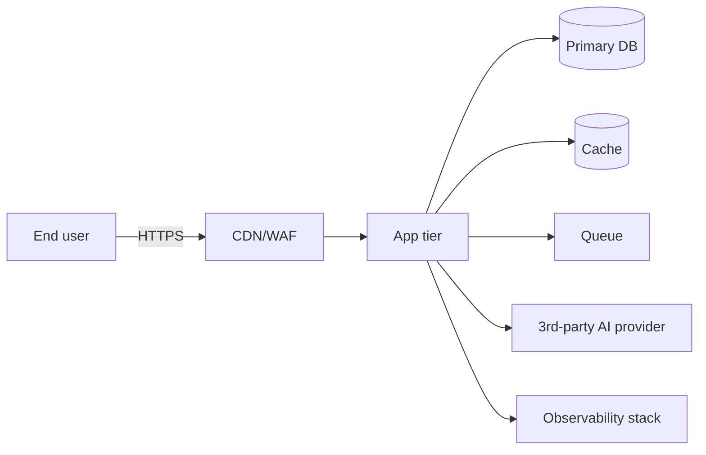

# Threat Model

> Owner: `security-compliance-officer` · Created at gate 3→4 · Updated when architecture changes

## Methodology
STRIDE per trust boundary. Risk = Likelihood × Impact, both Low/Med/High.

## Trust boundaries

_Replace with the actual architecture from `03-architecture.md`._

## Per-boundary STRIDE

### Boundary: User ↔ Edge
| Threat | Category | Likelihood | Impact | Mitigation | Residual |
|---|---|---|---|---|---|
| Credential stuffing | S |  |  | Rate limit + MFA + breached-password check |  |
| TLS downgrade | I |  |  | HSTS, TLS 1.2+ |  |

### Boundary: Edge ↔ App tier
| Threat | Category | L | I | Mitigation | Residual |
|---|---|---|---|---|---|

### Boundary: App ↔ DB
| Threat | Category | L | I | Mitigation | Residual |
|---|---|---|---|---|---|
| SQL injection | T |  |  | Parameterized queries / ORM |  |
| Privilege escalation | E |  |  | Least-priv DB user; row-level security |  |

### Boundary: App ↔ AI provider (if applicable)
| Threat | Category | L | I | Mitigation | Residual |
|---|---|---|---|---|---|
| Prompt injection | T |  |  | Input sanitization, output validation, system prompt isolation |  |
| PII leakage to provider | I |  |  | PII redaction before send; DPA with provider |  |

### Boundary: App ↔ Observability
| Threat | Category | L | I | Mitigation | Residual |
|---|---|---|---|---|---|
| PII in logs | I |  |  | Log scrubbing; structured logging with allowlist |  |

## Top 10 threats (ranked)
1.
2.
3.
...

## Cross-cutting controls
- Encryption at rest: _(algorithm + key management)_
- Encryption in transit: _(TLS version)_
- Secrets: _(secret manager + rotation cadence)_
- Authn: _(provider + MFA policy)_
- AuthZ: _(RBAC/ABAC model)_
- Audit logging: _(what's captured, retention, immutability)_
- Dependency scanning: _(tool + cadence)_
- Container/image scanning: _(tool + cadence)_

## Residual risk register
- _List residuals scoring Med or higher with explicit acceptance rationale._

## Approval
- Author: security-compliance-officer agent
- Reviewed by (human): _____
- Date:
